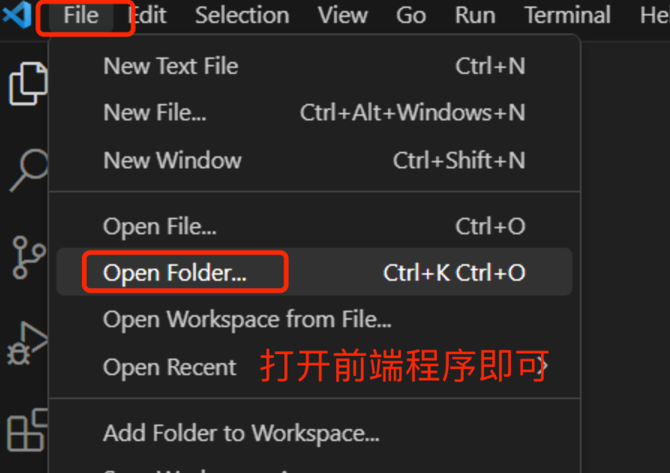
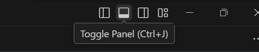

Node.js 是前端程序运行的服务器，类似Java程序运行的服务器Tomcat

Npm 是前端依赖包管理工具，类似maven依赖管理工具软件

# 1. Node和Npm安装

下载node-v16.16.0-x64.msi并安装，完成后可以在命令行终端输入`node -v`和`npm -v`查看版本。

# 2. 使用Npm

NPM全称Node Package Manager，是Node.js包管理工具，是全球最大的模块生态系统，里面所有的模块都是开源免费的；也是Node.js的包管理工具，相当于后端的Maven。

1. 配置阿里镜像

```shell
npm config set registry https://registry.npmjs.org/
```

2. 更新npm版本

```shell
npm install -g npm@9.6.6
```

3. npm依赖下载命令

```shell
npm install 依赖名 / npm install 依赖名@版本
```

# 3. 导入前端程序

将前端程序vue3-demo2.rar解压后，使用vscode打开



在vscode中打开终端：



```shell
npm install       //安装依赖
npm run dev       //运行测试
```

